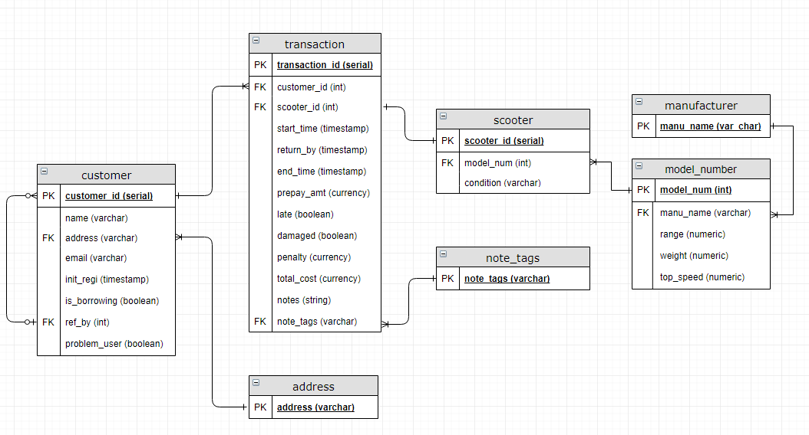

# Homework 05

## Scoot-Share

### Design Decisions

The database I created is not in 3NF - in particular, the transaction and scooter
tables have fields with transitive dependencies. For the transaction table, such 
fields include `late`, `total_cost`, and potentially `penalty`. These fields are
implied by other fields in the table (for example `late` can be calculated using
`end_time` and `return_by`). However, maintaining these fields allowed for easier
access to information that was quite important for the business logic that the 
database represented, so I felt their inclusion was warranted.

For the purposes of simplicity, the `address` table has only a single field. It is
obviously possible to extend this to fields like `zip`, `country`, `state`, etc,
but this would require additional tables to represent the one-to-many relationship,
and doesn't meaningfully add to the functionality of the database.

### Assumptions
This database design doesn't make 

Scripts

* [part-1-scoot-share-create.sql](part-1-scoot-share-create.sql)
* [part-1-scoot-share-queries.sql](part-1-scoot-share-queries.sql)

## Normalization
For the dataset, the only cleaning I did was to remove the "total" column,
since it was a transitive dependency, and since the information it provided
wasn't particularly useful, it wasn't worth the effort to try normalizing it.

* [Pokemon Dataset Original](Pokemon.csv)
* [Pokemon Dataset Cleaned](pokemon_cleaned.csv)
* [part-2-normalization-create.sql](part-2-normalization-create.sql)
* [part-2-normalization-import.sql](part-2-normalization-import.sql)
* [part-2-normalization-queries.sql](part-2-normalization-queries.sql)
